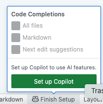
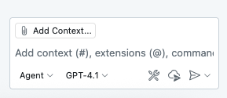

# CNS Tag Browser

All Capital News Service stories get at least one tag in the WordPress publishing system that CNS uses. They are displayed at the bottom of an article, like for [this 2011 story](https://cnsmaryland.org/2011/11/23/white-house-lets-move-program-lets-schools-snag-salad-bars/):


### Getting Started

What we're going to do is explore those tags as data and then use GitHub Copilot to build a searchable, sortable webpage that makes it easier to browse through all the tags CNS has used. This is your chance to learn how to work with an AI coding assistant to build something useful from scratch.

1. In the Terminal, cd into the directory with your last name.
2. Create a directory called cns_tag_browser using mkdir
3. cd into that new directory
4. Create a file called notes.md using touch. Keep that file open.
5. Open that document and put "CNS Tag Browser" and today's date at the top, then save it
5. Do NOT cd out of that directory

### Explore the Data

Before we start building, let's recall what we're working with. In the shared `data` directory, you'll find a file called `tags.json`. Open that up in the editor and spend a few minutes looking through it.

Now let's use sqlite-utils to get a better sense of the data. Try these commands in the Terminal:

```bash
# See tags with the most posts
uv run sqlite-utils memory data/tags.json "SELECT name, count FROM tags ORDER BY count DESC LIMIT 10"

# See tags that contain Trump
uv run sqlite-utils memory data/tags.json "SELECT name, count FROM tags where name like '%Trump%' ORDER BY count DESC LIMIT 10"

# See tags that contain Baltimore
uv run sqlite-utils memory data/tags.json "SELECT name, count FROM tags where name like '%Baltimore%' ORDER BY count DESC LIMIT 20"

```

Write a few sentences in your `notes.md` file about what you learned from these queries.

### Planning Your Tag Browser

Based on what you've seen in the data, think about what features would make a useful tag browser. Consider:

- How would someone want to search through 1000+ tags?
- What information should be displayed prominently?
- How should the tags be sorted by default?
- What filters might be useful?

Write a short "feature wishlist" in your `notes.md` file - this will guide your prompts to Copilot.

### Setting Up GitHub Copilot

Before we start building, we need to make sure GitHub Copilot is enabled in VS Code. Look at the lower right corner of your codespace; there should be an icon with "Finish Setup" next to it. If you click on "Finish Setup" you should see this:



Click the green "Setup Copilot" button. After a minute, you should see a new pane on the right side with this at the bottom:



You want "Agent" mode and for the model you should start with GPT-4.1 (or any of the models with 0x next to them - they are the free ones). Test it out by asking the agent to create a file called test.html with your name as a header, maybe using the <blink> tag, and serve it using a simple Python server.

### Building with GitHub Copilot

Now comes the fun part: you're going to use GitHub Copilot to build a webpage that displays the CNS tags in a user-friendly way. Here's your workflow:

1. **Start a new HTML file**: Create `index.html` in your tag browser directory
2. **Ask the agent**: Write a detailed note describing exactly what you want
3. **Iterate and improve**: Keep adding notes to request new features or modifications

You can create separate CSS and JavaScript files, but the page must use `tags.json` as its data source.

### Your Copilot Conversation

As you work with Copilot, document your process in `notes.md`. For each major feature/change you make, include:

1. **What Copilot suggested**
2. **Whether you accepted it or modified it**
3. **How well it worked**

### Testing Your Browser

Once you have a working version:

1. **Test it locally**: Use `uv run python -m http.server 8000` in your tag browser directory
2. **Open it in your browser**: Go to `http://localhost:8000`
3. **Try all the features**: Search, sort, filter - does everything work?
4. **Document any issues**: Add notes about what works and what doesn't

### Reflection

When you're done building, add a final section to your `notes.md` file reflecting on the experience:

- What surprised you about working with Copilot?
- Which prompts worked best for getting useful suggestions?
- What was frustrating or challenging?
- How would you change your approach next time?

**IMPORTANT:** in the chat window above where you put in prompts, right-click and choose "Copy All", then paste that to the bottom of your `notes.md` file.

### Submission

When you are finished, add, commit and push your changes:

```bash
git add .
git commit -m "CNS tag browser with Copilot"
git pull origin main
git push origin main
```

Submit the link to your tag browser directory (including both the working webpage and your `notes.md` file) in ELMS.

### Extra Credit

Want to go further? Try these advanced challenges:
- Add a "random tag" button that picks a random tag and shows its posts
- Create a tag comparison feature (compare two tags side by side)
- Add a "similar tags" feature that finds tags with similar names
- Implement tag clustering or grouping by topic
- Add data visualization (charts, graphs) of tag popularity over time

Remember: the goal isn't to write perfect code, it's to learn how to collaborate effectively with AI to build something useful. Focus on clear prompts and iterating based on what you get back!