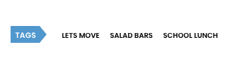

# CNS Tags

All Capital News Service stories get at least one tag in the WordPress publishing system that CNS uses. They are displayed at the bottom of an article, like for [this 2011 story](https://cnsmaryland.org/2011/11/23/white-house-lets-move-program-lets-schools-snag-salad-bars/):



### Getting Started

What we're going to do is to explore those tags as data and also test out the ability of LLMs to produce similar kinds of tags for CNS stories. In your class repository, open a codespace and do the following:

1. In the Terminal, cd into the directory with your last name.
2. Create a directory called cns_tags using mkdir
3. cd into that new directory
4. Create a file called notes.md using touch. Keep that file open.
5. Open that document and put "CNS Tags" and today's date at the top, then save it
6. Do cd .. twice to get back to the main directory (/workspaces/jour329w_fall2025)
7. In the Terminal, do the git add, commit, pull and push your changes as described in the `setup.md` file.


### One-Time Setup

In the Terminal, do this:

1. `uv add lxml_html_clean`
2. `uv run python`

Then, in the Python interpreter, do these:

```{python}
import nltk
nltk.download('punkt_tab')
```

When that finishes, hit Ctrl-D to get back to the Terminal and proceed.

### Basic Tag Exploration

Keep the `cns_tags.md` file in your directory open for editing. In the shared `data` directory, you'll find a file called `tags.json`. Open that up in the editor. In your `notes.md` file, describe what the data is and how it's organized. Can you tell what the most popular tags are? How would you describe determining which were the most common tags?

One of the tools we've installed, [sqlite-utils](https://sqlite-utils.datasette.io/en/stable/index.html), gives us the ability [to ask questions of data contained in CSV and JSON files](https://sqlite-utils.datasette.io/en/stable/cli.html#running-queries-directly-against-csv-or-json). Follow along as we do this with the tags.

Now, pick one of the top tags and open the link in a browser window. Choose a story and click on the link, then read the story. Put the URL and the title of the story in your `notes.md` file. Then run the following command in Terminal, replacing YOUR_URL with the actual URL. We'll be using a model called Kimi-K2 for this.

```{bash}
uv run python -m newspaper --url=YOUR_URL -of=text | uv run llm -m groq/moonshotai/kimi-k2-instruct-0905 "You are an expert at categorizing topics for news stories. Read the text and provide no more than 5 topics."
```

For the purpose of this assignment, you'll put each command, the output from it and your evaluation of it in `notes.md`. The goal is to get a list of topics that are at most two words in length that would make it easier for a reader to find this story browsing by topic or searching by keyword. YOU MUST PROVIDE ALL OF THE COMMANDS, OUTPUT & EVALUATION TO GET FULL CREDIT.

When you are done, add a paragraph or two to the bottom of the `notes.md` file about this assignment that focuses on the process. Was it easy to think of changes? Was it too repetitive? What do you think a better workflow would look like? Be creative: if you could control the whole process, how would it differ?

When you are finished, add, commit and push your changes:

```{bash}
git add .
git commit -m "replace with your commit msg"
git pull origin main
git push origin main
```

Submit the link to your `notes.md` file in ELMS.